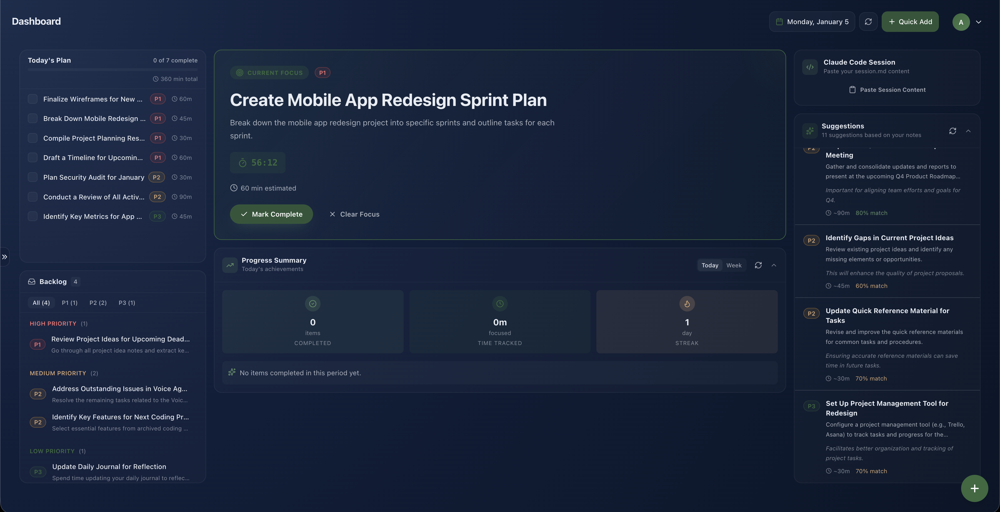
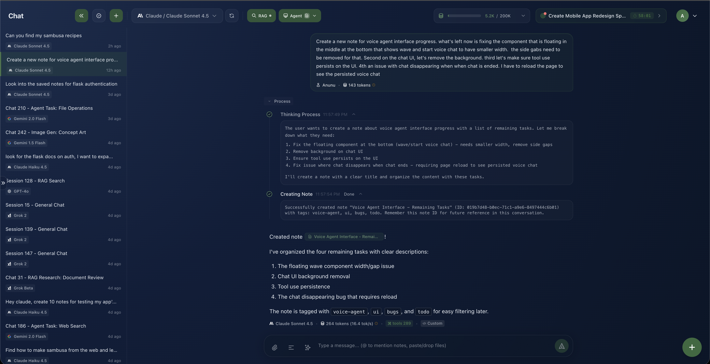
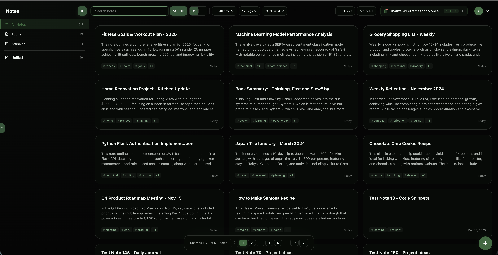
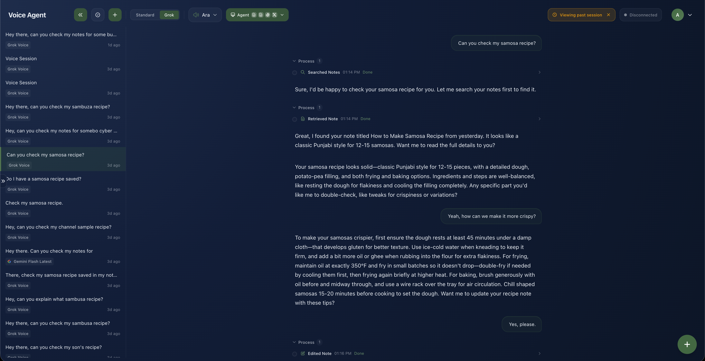
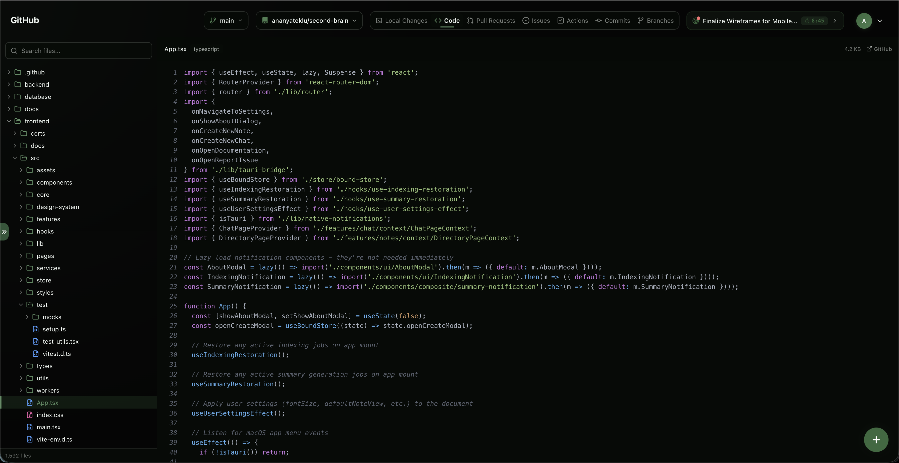
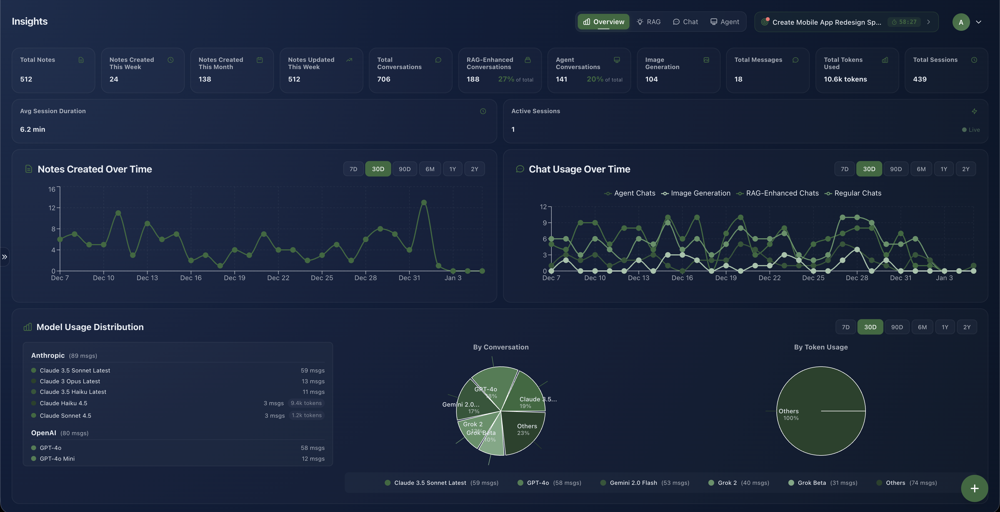

<!-- markdownlint-disable MD041 -->
<div align="center">


[](https://github.com/ananyateklu/second-brain/actions/workflows/backend-tests.yml)
[](https://github.com/ananyateklu/second-brain/actions/workflows/frontend-tests.yml)
[](LICENSE)
[](https://dotnet.microsoft.com/)
[](https://react.dev/)
[](https://www.typescriptlang.org/)
[](https://tauri.app/)
[](https://www.postgresql.org/)

**Intelligent knowledge management with multi-provider AI chat, smart notes, AI agents, and advanced RAG.**

</div>
<!-- markdownlint-enable MD041 -->

## Quick Start

```bash
git clone https://github.com/ananyateklu/second-brain.git && cd second-brain
cp .env.example .env          # Add your AI provider API keys
docker-compose up -d          # Access at http://localhost:3000
```

---

## Screenshots

<!-- markdownlint-disable MD033 -->
<div align="center">
<table>
<tr>
<td align="center"><br><b>Dashboard</b></td>
<td align="center"><br><b>AI Chat</b></td>
<td align="center"><br><b>Notes</b></td>
</tr>
<tr>
<td align="center"><br><b>Voice Agent</b></td>
<td align="center"><br><b>GitHub</b></td>
<td align="center"><br><b>Insights</b></td>
</tr>
</table>
</div>
<!-- markdownlint-enable MD033 -->

---

## Features

- AI-powered chat with **7 providers** (OpenAI, Anthropic Claude, Google Gemini, X.AI Grok, Ollama, Cohere, SemanticKernel)
- Smart notes with version history (PostgreSQL 18 temporal tables)
- AI agents with tool execution and **9 plugins**
- Advanced RAG with hybrid search (vector + BM25 + RRF fusion)
- **Voice agents** with real-time transcription and synthesis
- **Focus/productivity dashboard** with task suggestions
- GitHub integration with code browser
- Multi-provider image generation (DALL-E, Gemini, Grok Aurora)

---

## Tech Stack

| Layer | Technology |
|-------|------------|
| **Backend** | ASP.NET Core 10, PostgreSQL 18 + pgvector, Entity Framework Core, MediatR (CQRS) |
| **Frontend** | React 19, TypeScript 5.9, Vite 7, Tailwind CSS v4 |
| **Desktop App** | Tauri 2.0 (Rust), embedded PostgreSQL |
| **State Management** | Zustand (13 slices), TanStack Query v5 |
| **AI Providers** | OpenAI, Anthropic Claude, Google Gemini, Ollama, X.AI Grok, Cohere |
| **Vector Stores** | PostgreSQL pgvector (default), Pinecone |
| **Image Generation** | OpenAI DALL-E, Google Gemini, X.AI Grok Aurora |
| **Voice I/O** | Deepgram (STT), ElevenLabs/OpenAI (TTS), Grok Realtime |
| **Resilience** | Polly (circuit breaker, retry with exponential backoff) |

---

## Project Structure

```text
second-brain/
├── backend/src/
│   ├── SecondBrain.API/           # Controllers, middleware
│   ├── SecondBrain.Application/   # Services, CQRS, DTOs
│   ├── SecondBrain.Core/          # Entities, interfaces
│   └── SecondBrain.Infrastructure/ # EF Core, repositories
├── frontend/src/
│   ├── features/                  # 16 domain modules
│   ├── services/                  # API service layer
│   ├── store/                     # Zustand (13 slices)
│   └── components/                # Shared UI
├── frontend/src-tauri/            # Desktop app (Rust)
├── database/                      # 62 SQL scripts
└── docs/                          # ADRs, guides
```

---

## Installation

### Prerequisites

- **Docker & Docker Compose** (recommended)
- **.NET 10 SDK** (local development)
- **Bun 1.2+** (local development) - install via `curl -fsSL https://bun.sh/install | bash`
- **At least one AI provider API key** (OpenAI, Anthropic, Gemini, X.AI, or Ollama)

### Option 1: Docker (Recommended)

```bash
# 1. Clone and configure
git clone https://github.com/ananyateklu/second-brain.git
cd second-brain
cp .env.example .env

# 2. Edit .env with your settings
# Required: At least one AI provider API key
# Required: JWT_SECRET_KEY (32+ characters)

# 3. Start services
docker-compose up -d

# Access: http://localhost:3000
# API: http://localhost:3000/api
```

### Option 2: Local Development

```bash
# Terminal 1: Database
docker-compose up -d postgres

# Terminal 2: Backend
cd backend/src/SecondBrain.API
cp .env.example .env  # Configure API keys
dotnet watch run      # http://localhost:5001

# Terminal 3: Frontend
cd frontend
cp .env.example .env  # Set VITE_API_URL=http://localhost:5001/api
bun install && bun dev  # http://localhost:3000
```

### Option 3: Desktop App (macOS)

```bash
# Prerequisites
brew install postgresql@18 pgvector
curl --proto '=https' --tlsv1.2 -sSf https://sh.rustup.rs | sh

# Build and run
./backend/publish-mac.sh
cd frontend && bun run tauri:dev
```

Data stored in `~/Library/Application Support/com.secondbrain.desktop/`

---

## Configuration

### Essential Environment Variables

```bash
# Database
POSTGRES_PASSWORD=your-secure-password

# JWT (required, 32+ characters)
JWT_SECRET_KEY=YourSuperSecretKeyAtLeast32Characters

# AI Providers (at least one required)
OPENAI_API_KEY=sk-...
ANTHROPIC_API_KEY=sk-ant-...
GEMINI_API_KEY=...
XAI_API_KEY=...

# Vector Store (default: PostgreSQL)
VECTOR_STORE_PROVIDER=PostgreSQL
# Optional: Pinecone for cloud vector search
PINECONE_API_KEY=...
```

### AI Provider Settings

Configure in `appsettings.json` or environment variables:

| Provider | Default Model | Key Features |
|----------|---------------|--------------|
| OpenAI | gpt-4o-mini | Function calling, vision, structured output |
| Anthropic | claude-3-5-haiku-latest | Extended thinking, prompt caching |
| Gemini | gemini-2.0-flash | Code execution, grounding, context caching |
| X.AI | grok-3-mini | Live search, deep search, think mode |
| Ollama | qwen3:4b | Local models, no API key needed |
| Cohere | command-r-plus | Native reranking for RAG |

See `backend/src/SecondBrain.API/appsettings.json` for full configuration options.

---

## Architecture

### Web Deployment

```text
      ┌─────────────┐     ┌─────────────┐     ┌─────────────┐
      │   React     │────▶│   nginx     │────▶│  ASP.NET    │
      │  Frontend   │     │   :3000     │     │   Core      │
      └─────────────┘     └─────────────┘     └──────┬──────┘
                                                     │
                          ┌──────────────────────────┼──────────────────────────┐
                          │                          │                          │
                          ▼                          ▼                          ▼
                    ┌─────────────┐            ┌─────────────┐            ┌─────────────┐
                    │ PostgreSQL  │            │ AI Providers│            │   Pinecone  │
                    │ + pgvector  │            │ (7 total)   │            │  (optional) │
                    └─────────────┘            └─────────────┘            └─────────────┘
```

### Desktop App

```text
                    ┌────────────────────────────────────────────────────────┐
                    │                  Second Brain.app                      │
                    │  ┌──────────────────────────────────────────────────┐  │
                    │  │            Tauri Shell (Rust)                    │  │
                    │  └──────────────────────────────────────────────────┘  │
                    │                        │ IPC                           │
                    │  ┌──────────────────────────────────────────────────┐  │
                    │  │            React Frontend (WebView)              │  │
                    │  └──────────────────────────────────────────────────┘  │
                    │                        │ localhost:5001                │
                    │  ┌──────────────────────────────────────────────────┐  │
                    │  │            .NET Backend (Sidecar)                │  │
                    │  └──────────────────────────────────────────────────┘  │
                    │                        │                               │
                    │  ┌──────────────────────────────────────────────────┐  │
                    │  │         PostgreSQL (port 5433) + pgvector        │  │
                    │  └──────────────────────────────────────────────────┘  │
                    └────────────────────────────────────────────────────────┘
```

---

## API Reference

Full API documentation available at `/swagger` when running the backend.

### Key Endpoints

| Group | Base Path | Description |
|-------|-----------|-------------|
| Auth | `/api/auth` | Login, register, API keys |
| Notes | `/api/notes` | CRUD, versions, summaries, images |
| Chat | `/api/chat` | Conversations, streaming (SSE), image generation |
| Agents | `/api/agent` | Agent streaming with tool execution |
| Focus | `/api/focus` | Tasks, AI suggestions, progress summaries |
| Voice | `/api/voice` | Real-time voice sessions, transcription, synthesis |
| RAG | `/api/rag/analytics` | Query logs, feedback, topic clustering |
| Indexing | `/api/indexing` | Vector indexing jobs and stats |
| Git | `/api/git` | Repository operations, branches |
| GitHub | `/api/github` | PRs, issues, workflows |

---

## Troubleshooting

| Issue | Solution |
|-------|----------|
| **Database connection fails** | Verify PostgreSQL is running: `docker-compose ps` |
| **AI provider errors** | Check API key is set and provider is enabled in settings |
| **Vector search not working** | Run indexing: `POST /api/indexing/start` |
| **JWT authentication fails** | Ensure `JWT_SECRET_KEY` is 32+ characters |
| **CORS errors** | Add frontend URL to `CORS_ALLOWED_ORIGINS` |
| **Desktop app won't start** | Check PostgreSQL 18 is installed: `brew info postgresql@18` |

### Ports

| Service | Port |
|---------|------|
| Frontend | 3000 |
| Backend (local) | 5001 |
| PostgreSQL (Docker) | 5432 |
| PostgreSQL (Desktop) | 5433 |
| Ollama | 11434 |

---

## Documentation

| Document | Description |
|----------|-------------|
| [CLAUDE.md](CLAUDE.md) | Developer documentation and patterns |
| [RAG Tuning Guide](docs/RAG_TUNING_GUIDE.md) | Optimize RAG performance |
| [iOS Sync Guide](docs/ios-notes-sync-guide.md) | Set up iPhone/iPad sync |
| [Database README](database/README.md) | Schema documentation |
| [ADRs](docs/adr/) | Architecture decision records |

### Architecture Decisions

- [ADR 001](docs/adr/001-zustand-for-client-state.md) - Zustand for state management
- [ADR 006](docs/adr/006-cqrs-mediatr-pattern.md) - CQRS with MediatR
- [ADR 007](docs/adr/007-tauri-macos-desktop-app.md) - Tauri desktop app
- [ADR 014](docs/adr/014-agent-streaming-strategy-pattern.md) - Agent streaming strategies

---

## Development

### Running Tests

```bash
# Backend
cd backend && dotnet test

# Frontend
cd frontend && bun test
```

### Creating Migrations

```bash
# EF Core migration
cd backend/src/SecondBrain.API
dotnet ef migrations add MigrationName

# Check migration status
./database/migrate.sh status
```

---

## License

This project is licensed under the MIT License - see the [LICENSE](LICENSE) file for details.
