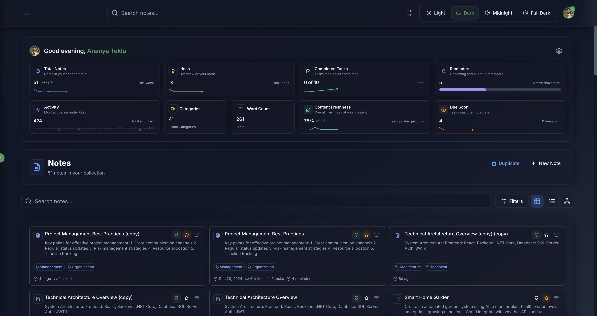

<!-- markdownlint-disable MD041 MD033 -->
<p align="center">
  <picture>
    <source media="(prefers-color-scheme: dark)" srcset="frontend/src/assets/second-brain-logo-dark-mode.png">
    <source media="(prefers-color-scheme: light)" srcset="frontend/src/assets/second-brain-logo-light-mode.png">
    
  </picture>
</p>

# AI-Powered Personal Knowledge Management System

Second Brain is a knowledge management and note-taking system that unifies your notes, ideas, tasks, and reminders in one interactive environment. It intelligently links related concepts, highlights relevant information, and provides guidance to help you gain clarity, maintain organization, and discover insights you may have overlooked—all within a single, easy-to-use workspace.

## Application Screenshots

<table>
  <tr>
    <td align="center">
      
      <br><em>Dashboard with analytics and quick stats</em>
    </td>
    <td align="center">
      
      <br><em>Notes collection with filters and categorization</em>
    </td>
  </tr>
  <tr>
    <td align="center">
      
      <br><em>Interactive graph visualization of connected notes</em>
    </td>
    <td align="center">
      
      <br><em>AI Agents interface with multi-provider support</em>
    </td>
  </tr>
</table>

## Core Features

### Knowledge Management

- Rich text editing with Markdown support
- Bi-directional linking across notes, ideas, tasks, and reminders
- Interactive graph visualization of content relationships
- Tagging, categorization, versioning, archiving, and soft delete features

### Tasks & Reminders

- Priority-based task management with status tracking and dependencies
- Time-based reminders with recurrence options
- Progress tracking and linking to related content
- **TickTick Integration**: Connect via OAuth 2.0 to manage TickTick tasks and synchronize them with Second Brain (configurable).

### AI Integration

- Multi-provider support (OpenAI, Claude, Gemini, Grok, Local via Ollama)
- Real-time streaming responses via SignalR
- AI-driven actions via a tool execution framework
- Voice transcription, audio processing, and RAG capabilities
- Natural language database operations

### Multi-Layered Theme System

- Three themes: Light, Dark, and Midnight with system preference detection
- CSS variables and Tailwind implementation with dynamic switching

## Technical Architecture

### Frontend

- React 18 with TypeScript and Vite
- State management via React Context API and custom hooks (optimistic updates)
- Tailwind CSS for styling
- SignalR client for real-time communication

### Backend

- ASP.NET Core 8.0 Web API with Entity Framework Core
- SQL Server database
- Standard patterns: Controller-service-repository, JWT authentication, SignalR hubs, soft delete
- Dedicated services for AI provider integration and third-party connections (e.g., TickTick)

### Database Structure

- EF Core code-first approach
- Designed for comprehensive relationships, bidirectional linking, and activity tracking
- Implements soft delete pattern and flexible tagging

## Getting Started

### Prerequisites

- Node.js 18+ and npm
- .NET SDK 8.0
- SQL Server 2019+
- Relevant API keys (OpenAI, Claude, Gemini, Grok)
- TickTick Developer Account credentials for integration
- Optional: Ollama setup (<http://localhost:11434>) for local AI models

### Frontend Setup

```bash
git clone https://github.com/yourusername/second-brain.git
cd second-brain/frontend
npm install
# Copy `frontend/.env.example` to `.env` and update API URLs and TickTick credentials
npm run dev
```

Configure the `.env` file (see `frontend/.env.example`) with the appropriate API URLs and TickTick credentials before running `npm run dev`:

```plaintext
# Example .env entries
VITE_TICKTICK_CLIENT_ID=your_ticktick_client_id
VITE_TICKTICK_REDIRECT_URI=http://localhost:5173/callback/ticktick
```

### Backend Setup

```bash
cd ../backend/SecondBrain.Api
dotnet restore
# Configure appsettings.json with connection string, JWT secret, AI keys, etc. (see appsettings.template.json or documentation)
dotnet ef database update
dotnet run
```

Ensure `appsettings.json` is correctly configured before running the application. Refer to documentation or a template file for structure.

## Content Linking Features

The system supports bi-directional linking across notes, tasks, reminders, and ideas, allowing for:

- Seamless navigation and relationship management
- Contextual connections with link types and metadata
- Dependency tracking and project organization
- Knowledge discovery through relationship exploration

## Implementation Considerations

Key aspects to be aware of:

- Optimistic updates are used for most UI interactions.
- AI response streaming uses SignalR, with provider-specific handling.
- The theme system includes some browser-specific adjustments.
- JWT tokens use refresh token rotation for security.
- TickTick synchronization behavior is configurable and subject to API limits.

## Acknowledgments

Thanks to the following projects and organizations that make Second Brain possible:

- **TickTick**: For providing an API to integrate task management.
- OpenAI for GPT-4 and DALL-E 3
- Anthropic for Claude models
- Google for Gemini
- Grok team for their API
- Ollama for local AI model support
- Lucide Icons for the beautiful icon system
- Tailwind CSS for the styling framework
- The open-source community for various tools and libraries
